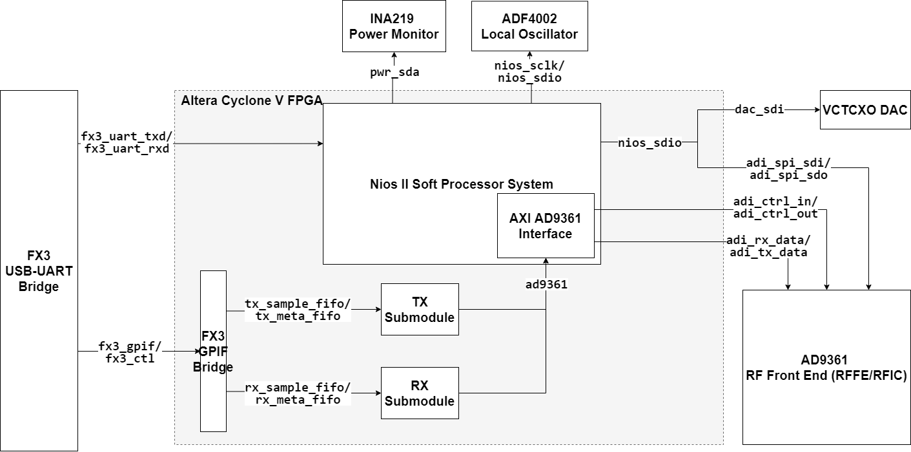

# bladeRF DFR Accelerator

## Project Overview

This paper aims to expand research on neural network enabled spectrum sensing by demonstrating a DFR implemented in a software-defined radio (SDR) to perform real-time spectrum sensing. The DFR algorithm was developed in software and evaluated against spectrum occupancy data collected by RWTH Aachen University. The DFR was then implemented on the bladeRF 2.0 SDR within its embedded field-programmable gate array (FPGA). 

This project has important practical implications for custom FPGA logic design for emerging SDRs. Few resources exist that instruct new users how to develop and integrate their own logic into FPGA-enabled SDRs. This project demonstrates this process for the bladeRF, and can be generalized to other similar SDRs.

## bladeRF Overview

The bladeRF 2.0 micro is a mid-tier software defined radio developed by Nuand. The device is capable of transmitting and receiving RF data over two transmit and two receive antennas. 

At the heart of this device is an Intel Altera Cyclone V FPGA. The FPGA acts as a bridge between AD9361 RFIC which receives and transmits RF data, and the host computer which performs digital signal processing on the in-phase and quadrature (I/Q) samples. The FPGA enables further configurability of this system by allowing a designer to implement custom logic in the FPGA architecture. Thus, a designer can create custom hardware units to perform filtering, modulation and cognitive radio tasks directly in the hardware. This is advantageous to designers because hardware implementations of these algorithms are likely to run faster than software implementations, in addition to consuming less power. 

The Cypress FX3 USB 3.0 peripheral controller manages transactions between the SDR and the host computer. The host sends packetized data requests to the SDR to configure the frequency, voltage controlled oscillator (VCO), and gain settings. These data packets are translated from the USB protocol to UART and then interpreted by the FPGA which performs the hardware updates. The controller also reads the stream of I/Q sample data over the general programmable interface (GPIF) bus, and sends these to the host computer via the USB interface. 

The last major component is the Analog Devices AD9361 RF transceiver. The transceiver is interfaced with four SMA antenna interfaces and supports multiple-input, multiple-output antenna configurations. The device is configured by the FPGA using the SPI interface which connects directly to its internal registers. The TX IQ and RX IQ interfaces carry the IQ samples between the transceiver and the FPGA.

The challenge in developing custom hardware to run on the programmable logic of this device is the difficulty in learning and adapting custom hardware intellectual property (IP) to the bladeRF's FPGA architecture. [Nuand has provided documentation to explain the software and hardware features of their device](https://github.com/Nuand/bladeRF/wiki/FPGA-Development). However, designers must still spend time dissecting the extensive list of VHDL and Verilog source code that is used to program the FPGA in order to adequately integrate their own IP. The following sections will breakdown the bladeRF's FPGA architecture to provide readers with an understanding of the functional units in this SDR system.

## bladeRF FPGA Development

The bladeRF's bridge logic between the AD9361 RFIC and the host computer is implemented on the Intel Altera Cyclone V FPGA (5CEBA4F23C8). 

In this architecture, UART packets are received from the external FX3 USB controller and processed by a Nios II soft processor system. If the packets contain configuration data, the soft processor translates these packets into configuration commands that get sent to the external power monitor, local oscillator, or RFIC. The processor system is able to translate this data using several internal IP cores that create I2C and SPI transactions. Otherwise if the packets contain data requests, the processor instructs its internal AD9361 interface controller to read data from the RFIC and send it to the receive first-in first-out queue (RX FIFO). 

The RX FIFO acts as a buffer that synchronizes the rate at which the host is requesting RX samples to the rate that the RFIC is making them available. During its transition through the RX FIFO, the signed 12 bit in-phase and quadrature samples from the RFIC ADCs are sign-extended to 16 bits and concatenated to make 32 bit samples. These samples are sent to the host computer using the FX3 GPIF bridge module. 

The bladeRF Python package is used to read the received samples from the bladeRF device. In addition to reading and writing data to the device, the package can also be used to program the FPGA with a custom bit file (.rbf).

## Repository Overview
- `python`
    - contains the Python code used to create the spectrum occupancy data sets and to create the DFR models
    - `spectrum_sensing_data.ipynb` is the Jupyter notebook used to create the spectrum occupancy data
    - `narma10_dfr.ipynb` is the Jupyter notebook used to simulate the DFR with the NARMA10 time series
    - `spectrum_sensing_dfr.ipynb` is the Jupyter notebook used to simulate the DFR with the spectrum occupancy data
- `intel_hls`
    - contains the C++ code used to synthesize the DFR IP Cores
    - `hls_float_dfr_narma10` is the folder containing the C++ code used to synthesize the NARMA10 DFR core
    - `hls_float_dfr_spectrum` is the folder containing the C++ code used to synthesize the spectrum sensing DFR core
- `fpga`
    - contains HDL code that was created to support this project
    - `dfr_rom` contains the VHDL and Verilog code used to implement the I/Q data ROM
    - `dfr_fsm` DFR finite state machine for the bladeRF architecture
    - `bladerf-hosted.vhd` is the modified top level file for the bladeRF

<!-- ## Development Notes
- Hosted Image
    - Shuffles I/Q samples between the FX3 (via GPIF II interface) and RFIC
    - Configures the RFIC via SPI based on commands from FX3 via UART
    - Control Si5338 clock generator chip and VCTCXO DAC
    - Default bladeRF image: bladerf-hosted.vhd
- Nios II
    - FPGA soft microprocessor embedded in bladeRF FPGA
    - Handles command/control
    - Receives packetized requests from host software via FX3 chip via UART
        - E.g.: set frequency/gain, IQ imbalance correction, sample rate, etc.
    - Communicates with FPGA logic via input/output ports of `nios_system` component 
- Custom Code
    - Should be placed between sample/meta FIFO blocks and iq correction blocks

## bladeRF FPGA Image Components

### rx_packet_generator
RX Packet Generator

### system_pll
80 MHz System Clock (38.4 MHz Reference Clock)

### fx3_pll
FX3 PLL (PCLK)

### pll_reset
PLL Reset

### ps_sync
Power Supply Synchronization

### fx3_gpif
FX3 GPIF

### nios_system
NIOS System

### tx
TX Submodule

### rx
RX Submodule

### reset_synchronizer
Reset Synchronizer

### synchronizer
Synchronizer

### handshake
Handshakes -->

## Project To-Do List
- Test bladeRF against internal sample ROM
- Test bladeRF against real time I/Q samples
- Optimize architecture for low power and low area
- Add online learning via stochastic gradient descent
- Implement a spiking neural network model